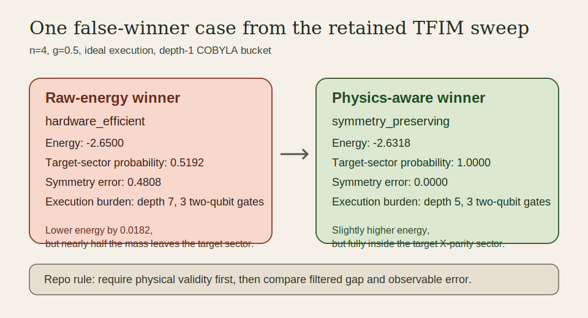

# Noise-Body VQE for Transverse-Field Ising Chains

**In one sentence.** FieldLine studies VQE failure as environmental physics: it models structured noise bodies and asks which body caused which physical deformation in the learned TFIM state.



**Project identity.** FieldLine treats VQE as an imperfect physical instrument, not only an optimizer. The repo models local dephasing, amplitude damping, correlated ZZ noise, coherent drift, readout distortion, and hardware-style phenomenological noise as distinct environmental bodies, then records the deformation signature each body leaves in energy, symmetry, magnetization, correlations, entanglement, variance, and trainability. False winners are still central here, but they are treated as one important deformation mode rather than the whole identity.

**Committed artifact layout.** Reproducible baselines live in `results/baselines/`, wider sweeps and crossover studies live in `results/studies/`, noise-body atlas outputs live in `results/noise_bodies/`, runtime smoke outputs live in `results/runtime/`, and regenerable maintenance outputs land in `audit/` and `release/`.

## Noise-body framing

FieldLine keeps the TFIM Hamiltonian as the physical system,

\[
H_{\mathrm{TFIM}} = -J \sum_i Z_i Z_{i+1} - g \sum_i X_i ,
\]

but treats the environmental term as a structured body rather than a generic nuisance parameter. In the current repo slice, the supported bodies are:

- `ideal`
- `local_dephasing`
- `amplitude_damping`
- `depolarizing`
- `correlated_zz_noise`
- `coherent_x_drift`
- `coherent_z_drift`
- `readout_only`
- `hardware`

The main artifact is no longer only a gap table. It is a deviation-signature table that asks which body moved which observable first.

## One case where raw energy picked the wrong winner

- `setup:` `n=4`, weak-field TFIM (`g=0.5`), ideal execution, depth-1 COBYLA sweep from `results/studies/wide_crossover_behavior_crossover.csv`.
- `raw-energy winner:` the hardware-efficient ansatz reached energy `-2.6500`, but only `51.92%` of the state remained in the target `X`-parity sector and the symmetry-breaking error was `0.4808`.
- `physics-aware winner:` the symmetry-preserving ansatz reached energy `-2.6318`, kept `100%` of the probability mass in the target sector, and drove the symmetry-breaking error to numerical zero.
- `why they differed:` the lower-energy candidate bought a `0.0182` raw-energy gain by spilling almost half of its probability mass out of the target sector.
- `what criterion I trusted more:` the symmetry-preserving result, because this repo treats target-sector validity as a prerequisite for comparing gap and observable error, not as an after-the-fact footnote.

**Headline baseline result.** In the committed near-critical baseline capture, symmetry-aware filtering reduces the exact-gap error from `1.8857` to `1.5469`, lowers observable-error L2 from `0.3376` to `0.1887`, and preserves `43.49%` probability mass in the target `X`-parity sector (`results/baselines/baseline_capture_single.json`, `results/baselines/baseline_capture_study_behavior_report.md`).

**Hand-written note.** [What surprised me in this repo](docs/notes/what_surprised_me.md).

This repository turns the original FieldLine VQE scaffold into a more physics-aware study of **how structured environmental bodies deform TFIM variational states across ansatz family, optimizer choice, field regime, symmetry handling, measurement strategy, and mitigation settings**.

The repo is meant to read less like “a clean VQE demo” and more like:

> a structured study of environment-induced deformation, symmetry leakage, observable drift, and mitigation tradeoffs for transverse-field Ising chains.

## Core question

A stronger framing for the project is:

> When VQE deviates from the exact TFIM ground state, can we classify the physical cause of the deviation by the pattern it leaves in energy, symmetry, magnetization, correlations, entanglement, variance, and gradients?

## What is materially stronger now

### 1. The project is no longer energy-only

Each run records physics-facing observables beyond the variational energy:

- magnetization in the `X` direction
- magnetization in the `Z` direction
- mean nearest-neighbor `XX` correlation
- mean nearest-neighbor `ZZ` correlation
- full nearest-neighbor `XX` and `ZZ` correlation profiles
- global `X`-parity expectation
- even/odd parity-sector occupancy
- fidelity to the exact ground state when exact diagonalization is available
- half-chain entanglement entropy only when a full simulated state object is available
- energy variance and energy standard deviation as eigenstate-quality diagnostics
- connected nearest-neighbor XX and ZZ correlators, not just raw correlators

That last restriction matters: the repo only reports half-chain entanglement entropy for local statevector or density-matrix simulation, not for sampled-only or hardware-style observable paths.

### 2. Symmetry is now both a diagnostic and an active optimization bias

The study keeps the raw-vs-filtered symmetry analysis, but it also adds a **physics-aware cost function**:

\[
C(\theta) = \langle H \rangle - \lambda \langle \Pi_X \rangle
\]

where `Π_X = ∏ X_i` is the TFIM global `X`-parity operator used throughout this repo.

Why the sign looks like this: the constant term from `λ(1 - <Π_X>)` does not affect the optimizer, so the implementation minimizes the equivalent operator `H - λ Π_X`.

This means symmetry is no longer just something logged after the run. When `--symmetry-penalty-lambda > 0`, the optimizer is pushed away from symmetry-breaking regions during the loop.

### 3. False winners are first-class outputs, not side effects

A shallow hardware-efficient ansatz can sometimes look artificially strong under noise because it accumulates less gate error, even while leaking out of the correct symmetry sector.

The study now exports a dedicated `*_crossover.csv` that records both:

- the **lowest-energy** candidate
- the **physics-aware** winner selected by filtered gap plus symmetry and observable penalties

This makes it obvious when the nominal energy winner is a cheap-but-unphysical local minimum. The crossover table also records whether any physically valid candidates existed inside each bucket, so the study can prefer symmetry-respecting solutions when they are available.

### 3.5. Symmetry is now aligned to the **exact target sector**, not a hard-coded even sector

The repository now derives the target `X`-parity sector from the exact ground-state reference and uses that target consistently in:

- symmetry projection summaries
- sampled parity filtering
- symmetry-breaking penalties
- physical-validity flags
- crossover analysis

This matters for methodological honesty. The code no longer assumes that "even" is always the right physical sector; it checks the exact reference first and then evaluates VQE outputs against the correct target sector.

### 3.6. Exact-reference metadata is deeper

Each run now carries additional exact-spectrum context:

- exact ground-state energy
- exact first-excited-state energy
- exact many-body spectral gap
- exact target `X`-parity sector

That makes the output more useful for condensed-matter interpretation and for debugging cases where a VQE run lowers the energy but still fails to reproduce the correct physical sector.

### 4. Observable grouping is explicit instead of implicit

The TFIM Hamiltonian and parity-aware cost operator are decomposed into explicit **qubit-wise commuting (QWC)** groups. The repo records:

- the measurement groups
- their Pauli content
- the shots assigned to each group
- empirical pre-flight group variances when variance-aware allocation is enabled

This avoids hand-waving around measurement cost and lets the writeup say how much shot overhead each observable family actually incurred.

### 5. Shot allocation is now configurable and visible

The study now supports three local shot-allocation strategies for grouped measurements:

- `equal`
- `coefficient_weighted`
- `variance_weighted`

The variance-weighted path performs a small pre-flight measurement stage, estimates group variances, converts them into standard-deviation weights, and allocates the main budget using those empirical uncertainty estimates.

This matters because for TFIM,

\[
H = -J \sum_i Z_i Z_{i+1} - g \sum_i X_i
\]

and the informative measurement basis can change with the field regime. A single fixed 50/50 split is often a poor description of a research-grade measurement budget.

### 6. Noisy optimization is treated as noisy optimization

The repo no longer assumes a perfectly smooth landscape in all cases.

- `COBYLA` and `SLSQP` remain available
- `SPSA` is now implemented as a custom noisy-loop optimizer
- dynamic shot scaling can be enabled so early exploration uses fewer shots and late-stage refinement uses more

That gives the study a much better story for hardware-facing optimization than “just run a deterministic classical optimizer and hope.”

### 7. ZNE is now part of the mitigation story

For the local noisy study, the code can optionally run a simple **simulator-side zero-noise extrapolation workflow** by evaluating grouped shot-based costs at scaled noise factors and extrapolating back to zero noise.

For IBM Runtime, the helper continues to expose Runtime mitigation toggles such as TREX-style measurement mitigation and ZNE configuration. IBM Runtime support is kept as an optional execution surface, while the local simulator path remains the fully validated path in this repository.

### 8. The Runtime observable-remapping story is safer

The Runtime helper now tries to use the transpiled circuit’s **final observable layout** rather than assuming the initial layout is sufficient. That matters because routing and swap insertion can change the effective logical-to-physical mapping during transpilation.

## Measurement architecture

### Estimator-style energy path

The main VQE-style loop conceptually targets expectation values of grouped operators.

In the local simulator path, this repo now evaluates grouped Pauli measurements directly so that shot allocation, shot inflation, and optional ZNE are all visible in the methodology.

In a real IBM Runtime workflow, the repo’s `runtime.py` helper prepares the corresponding ISA-circuit plus observable-remapping path for Estimator-style execution.

### Sampler-style parity path

The parity-retention diagnostic remains a **bitstring-based sampled diagnostic**, not an in-loop Estimator post-selection scheme.

That distinction is intentional. Post-selection requires access to shot-level measurement outcomes, which is fundamentally a Sampler-style workflow rather than a plain expectation-value query.

### Readout mitigation in the local path

The local grouped-shot estimator and sampled parity diagnostic now support an **independent per-qubit readout-mitigation step** based on matrix inversion of the configured readout channel. The implementation accepts either a single symmetric readout rate or separate `0→1` and `1→0` probabilities, and the study sweep preserves those asymmetric settings instead of collapsing them back to a single scalar.

This does not magically turn the simulator path into a full hardware-calibration stack, but it does mean the repo no longer reports raw parity retention while silently ignoring the configured readout channel. The remaining limitation is explicit too: the mitigation assumes independent qubit readout and clips negative quasi-probabilities for stability.

## Scientific questions the repo can now answer better

This version is better positioned to support claims like:

- deeper problem-inspired circuits help in ideal settings, but their advantage collapses past a gate-error threshold
- symmetry-preserving or symmetry-penalized runs suppress unphysical low-energy “wins” from symmetry-breaking ansätze
- the useful measurement basis and shot allocation depend on field strength and observable family
- mitigation can buy back some depth advantage, but not for free
- parity filtering can improve observable accuracy, and sampled retention numbers become more meaningful once readout mitigation is applied, though they still remain a diagnostic rather than a substitute for full hardware calibration

## Repository structure

```text
.
├── audit/
│   └── .gitkeep
├── docs/
│   ├── figures/
│   │   └── false_winner_case.svg
│   └── notes/
│       └── what_surprised_me.md
├── README.md
├── pyproject.toml
├── requirements.txt
├── results/
│   ├── baselines/
│   ├── noise_bodies/
│   ├── runtime/
│   └── studies/
├── release/
│   └── .gitkeep
├── src/
│   └── fieldline_vqe/
│       ├── __init__.py
│       ├── ansatz.py
│       ├── cli.py
│       ├── config.py
│       ├── experiment.py
│       ├── hamiltonian.py
│       ├── metrics.py
│       ├── noise.py
│       ├── noise_bodies.py
│       ├── observables.py
│       ├── pipeline.py
│       ├── plotting.py
│       ├── results.py
│       ├── runtime.py
│       └── study.py
├── tools/
│   ├── audit_deps.py
│   ├── audit_surface.py
│   ├── build_native.py
│   ├── capture_baseline.py
│   ├── compare_baseline.py
│   ├── live_runtime_smoke.py
│   ├── package_release.py
│   └── verify_release.py
└── tests/
    ├── test_config.py
    ├── test_execution.py
    └── test_hardening.py
```

## Main modules

### `ansatz.py`
Builds the three ansatz families used in the study.

### `observables.py`
Defines the observable bundle, QWC measurement grouping, grouped-shot estimators, and simulator-only entropy handling.

### `experiment.py`
Handles exact diagonalization, noisy or ideal objective evaluation, symmetry-aware cost construction, optimization, parity projection, sampled parity diagnostics, JSON export, and plotting.

### `study.py`
Runs multi-parameter sweeps and exports:

- raw per-run CSV
- aggregated summary CSV
- physics-aware crossover CSV
- summary JSON
- a main study figure

### `runtime.py`
Adds an optional IBM Runtime-style execution path for ISA-circuit transpilation, final-layout observable remapping, and Estimator mitigation options.

## Installation

```bash
python -m venv .venv
source .venv/bin/activate
pip install -r requirements.txt
pip install -e .
```

For IBM Runtime support:

```bash
pip install -e .[runtime]
```

### Live runtime preflight for scalable studies

The repo also includes an opt-in **live IBM Runtime smoke path**. It is meant to validate the real-backend execution surface before scaling a study, not to replace the wider local sweep.

```bash
export IBM_RUNTIME_TOKEN=...
python tools/live_runtime_smoke.py --output results/runtime/live_runtime_smoke.json

FIELDLINE_VQE_RUN_LIVE_RUNTIME=1 pytest tests/test_execution.py -k live_runtime -v
```

The exported JSON includes the backend, job id, ISA circuit width, ISA observable width, exact ground energy, and the live-vs-exact energy gap. That makes the artifact directly comparable to study-style metrics when you later widen the runtime grid across `(n_qubits, field_strength, gate_error, ansatz, seed)`.

A single live smoke run only validates the runtime plumbing: credentialing, backend selection, transpilation, observable remapping, submission, and possibly result retrieval. The actual crossover or scaling correlation story still has to come from repeated study buckets, not from one backend job.

## Usage

### Single run

```bash
python -m fieldline_vqe.cli \
  --mode single \
  --n-qubits 6 \
  --field-strength 1.0 \
  --ansatz symmetry_preserving \
  --depth 2 \
  --optimizer COBYLA \
  --symmetry-penalty-lambda 0.25 \
  --output-prefix results/examples/tfim_single
```

### Noisy single run with variance-aware grouping, SPSA, dynamic shots, and local ZNE

```bash
python -m fieldline_vqe.cli \
  --mode single \
  --n-qubits 6 \
  --field-strength 1.0 \
  --ansatz problem_inspired \
  --depth 2 \
  --optimizer SPSA \
  --use-noise \
  --gate-error 0.01 \
  --shot-allocation variance_weighted \
  --preflight-shots 256 \
  --base-shots 512 \
  --final-shots 4096 \
  --enable-dynamic-shots \
  --enable-zne \
  --zne-factors 1,3,5 \
  --output-prefix results/examples/tfim_noisy
```

### Full study sweep

```bash
python -m fieldline_vqe.cli \
  --mode study \
  --system-sizes 4,6,8 \
  --field-strengths 0.5,1.0,1.5 \
  --depths 1,2,3 \
  --ansatzes hardware_efficient,symmetry_preserving,problem_inspired \
  --optimizers COBYLA,SPSA,SLSQP \
  --gate-errors 0.0,0.005,0.01 \
  --symmetry-penalty-lambda 0.2 \
  --shot-allocation variance_weighted \
  --enable-dynamic-shots \
  --enable-zne \
  --seeds 7,21 \
  --max-iter 80 \
  --output-prefix results/examples/tfim_study
```

### Noise-body sweep

```bash
python -m fieldline_vqe.cli noise-body-sweep \
  --n-values 4 \
  --g-values 0.5,1.0 \
  --depths 1 \
  --ansatzes hardware_efficient,symmetry_preserving \
  --optimizers COBYLA \
  --bodies ideal,local_dephasing,amplitude_damping,correlated_zz_noise,coherent_z_drift \
  --strengths 0.005,0.01 \
  --max-iter 8 \
  --output-stem results/noise_bodies/noise_body_sweep
```

This writes a raw run table, an aggregated summary, deviation signatures, a body atlas report, a critical-drift map, a gradient-collapse report, and a simple body-matching report.

## Output artifacts

### Single-run mode

Single-run mode writes:

- `PREFIX.json`: exact reference, optimized parameters, observables, symmetry summaries, measurement grouping, shot allocation, and mitigation metadata
- `PREFIX.png`: objective convergence, raw-vs-filtered gap, symmetry quality, and observable error

### Study mode

Study mode writes:

- `PREFIX_raw.csv`: one row per run
- `PREFIX_summary.csv`: mean and standard deviation across seeds
- `PREFIX_crossover.csv`: energy winner vs physics-aware winner at each `(n_qubits, field_strength, gate_error)` point
- `PREFIX_behavior.json`: a higher-level behavior payload with regime, ansatz, optimizer, crossover, and deceptive-low-energy analyses
- `PREFIX_behavior_report.md`: a narrative behavior report that turns the sweep into an interpretable study
- `PREFIX_behavior_regimes.csv`: regime-level behavior profiles across weak-field, near-critical, and strong-field buckets
- `PREFIX_behavior_ansatz.csv`: ansatz-level win counts, fragility slopes, validity rates, and execution-burden summaries
- `PREFIX_behavior_optimizers.csv`: optimizer-level behavior summaries
- `PREFIX_behavior_crossover.csv`: enriched crossover table with regime labels, uncertainty-aware winner comparisons, and execution deltas
- `PREFIX_behavior_deceptive_cases.csv`: runs with deceptively low energy but poor physical credibility
- `PREFIX.json`: full study payload
- `PREFIX.png`: main summary figure for field, noise, size, and symmetry trends

## What a strong final result should sound like

A strong writeup from this repo should now be able to say something specific, for example:

- the hardware-efficient ansatz can appear to win by raw energy under noise, but those wins often coincide with elevated symmetry-breaking error
- adding a symmetry penalty into the optimization loop reduces those false wins
- variance-aware grouped measurements change the effective shot budget across TFIM regimes
- SPSA with dynamic shots is more stable than deterministic optimizers once shot noise is part of the loop
- local ZNE partially restores deeper ansätze, but only up to a regime-dependent crossover point

## Current limitations

This repo is materially stronger than the original version, but four limitations still matter:

- **Mitigation realism.** The local mitigation path is still simulator-first, and the readout correction assumes independent per-qubit channels with clipped quasi-probabilities.
- **Scale limits.** Exact benchmarking, exact target-sector labels, and exact-gap calibration are naturally limited to small chains.
- **Scalarization choice.** The crossover score is physics-aware, but it still reflects a chosen weighting of gap, symmetry error, and observable error.
- **Runtime access limits.** Runtime support is structurally ready, but broader backend studies still depend on credentials, queue access, and quota control.

## Best next experimental step

The best next step is now narrower and stronger than before:

run one bounded Runtime campaign that directly compares

- no mitigation
- TREX-style measurement mitigation
- ZNE
- symmetry penalty only
- symmetry penalty plus mitigation

for the same TFIM workloads and the same grouped observable set, then compare **raw energy winners** against **physics-aware winners** in the final analysis.


## Measurement Methodology

The noisy grouped-estimation path now caches **transpiled parameterized measurement templates** per `(ansatz structure, measurement basis, noise signature)` and reuses preflight shots when `variance_weighted` allocation is enabled. That means the study loop no longer recompiles the same measurement skeleton on every noisy objective evaluation; only parameter binding and execution are repeated.


## Final hardening additions

This version adds four deeper integrity features beyond the earlier research-grade pass:

- **Runtime observable remapping diagnostics:** routed ISA transpilation now exposes initial and final layout metadata, and tests verify that observables are remapped using the resolved final index layout rather than a naive initial placement.
- **ZNE execution metadata:** noisy runs now export the unmitigated cost, the ZNE sample count, the ZNE sample list, and the mitigation gain so the mitigation path is inspectable instead of opaque.
- **Hardware / execution-cost metrics:** each run now exports transpiled depth, transpiled two-qubit count, transpiled entangling-layer count, objective-call count, shot schedule, and estimated total shots used. The study crossover report also records a separate **budget winner** that is chosen by execution burden inside the physically valid bucket.
- **Deeper optimizer-behavior tests:** the test suite now checks runtime-layout remapping, ZNE metadata execution, dynamic shot scaling, and the symmetry penalty at the cost-operator level.

The repo still treats exact diagonalization as the scientific source of truth for small systems, and the strongest validated workflow remains the local Qiskit + Aer path.
